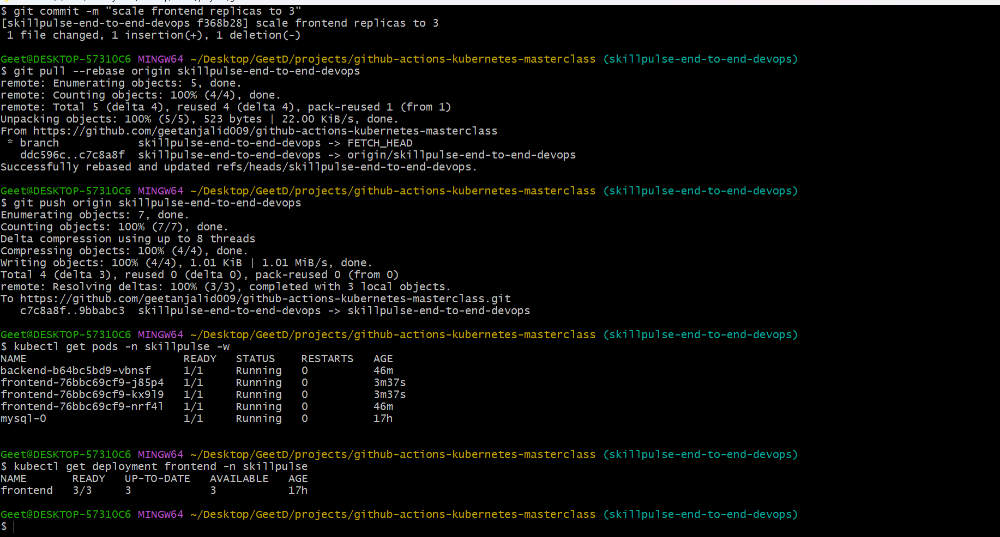
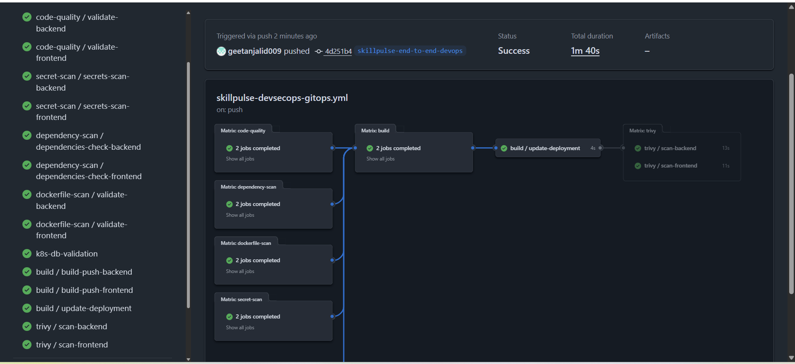
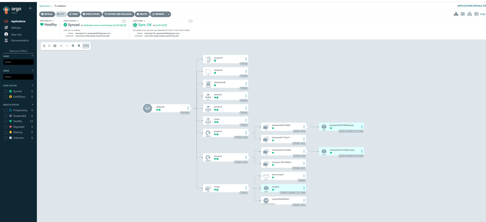
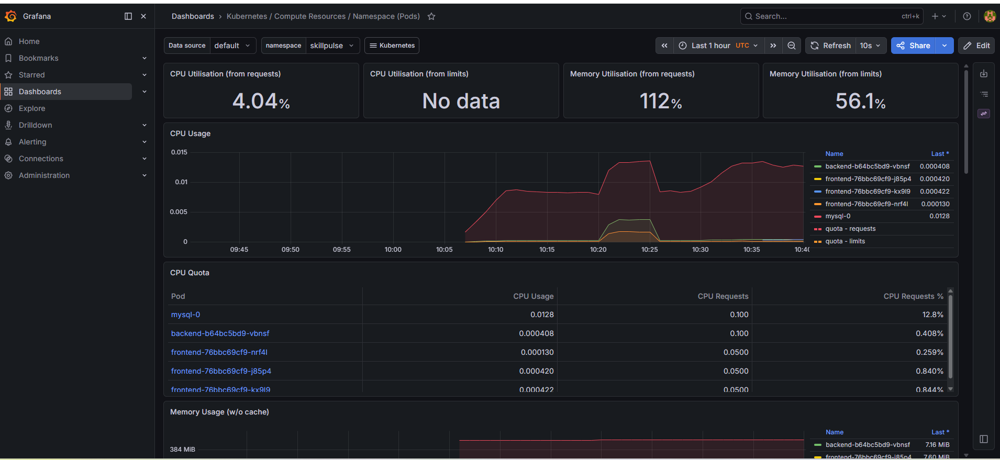
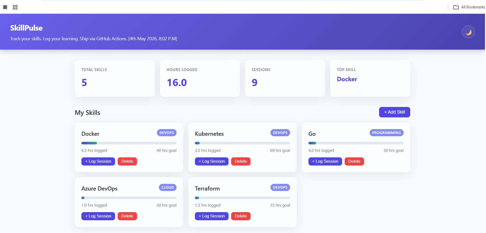

SkillPulse — Production Grade DevOps Project on Kubernetes
# SkillPulse — End-to-End Production Grade DevOps Project on Kubernetes

SkillPulse is a production-style end-to-end DevOps project designed to simulate a real-world cloud-native application deployment workflow using Docker, Kubernetes, GitHub Actions, ArgoCD, and monitoring tools.

This project demonstrates containerization, Kubernetes orchestration, CI/CD automation, GitOps deployment, monitoring, troubleshooting, and infrastructure practices followed in modern DevOps environments.

---

# Project Objective

The goal of this project is to practice and implement:

- Docker containerization
- Kubernetes deployment
- StatefulSet for MySQL
- CI/CD with GitHub Actions
- GitOps with ArgoCD
- Monitoring and observability
- Kubernetes troubleshooting
- Production-grade deployment practices

---

# Project Architecture

```text
User / Browser
       ↓
Frontend Service (Kubernetes Service)
       ↓
Frontend Pod (Nginx / UI)
       ↓
Backend Service
       ↓
Backend Pod (API Layer)
       ↓
MySQL Service
       ↓
MySQL StatefulSet + Persistent Storage


Tech Stack Used
Category	Tools / Technologies
Containerization	Docker
Container Registry	Docker Hub
Orchestration	Kubernetes (kind)
CI/CD	GitHub Actions
GitOps	ArgoCD
Monitoring	Prometheus & Grafana (planned)
Cloud	AWS (upcoming deployment)
Scripting	Shell
Version Control	Git & GitHub
OS	Linux / Git Bash / Windows

Kubernetes Components Used
Namespace
Deployment
Service
StatefulSet
ConfigMap
Secret
Persistent Volume
Persistent Volume Claim
Rollout Strategy
Health Checks
Service Discovery

Docker Images
geetanjalid009/skillpulse-backend:latest
geetanjalid009/skillpulse-frontend:latest

Project Deployment Steps
1️⃣ Clone Repository
git clone <your-repo-url>
cd github-actions-kubernetes-masterclass

2️⃣ Build Docker Images
docker build -t geetanjalid009/skillpulse-backend:latest ./backend
docker build -t geetanjalid009/skillpulse-frontend:latest ./frontend

3️⃣ Create Kubernetes Cluster
kind create cluster --config k8s/kind-config.yaml --name skillpulse

4️⃣ Load Images into kind Cluster
kind load docker-image geetanjalid009/skillpulse-backend:latest --name skillpulse
kind load docker-image geetanjalid009/skillpulse-frontend:latest --name skillpulse

5️⃣ Deploy Kubernetes Manifests
kubectl apply -f k8s/00-namespace.yaml \
               -f k8s/10-mysql.yaml \
               -f k8s/20-backend.yaml \
               -f k8s/30-frontend.yaml

Verify Deployment

Check Pods
kubectl get pods -n skillpulse
Check Services
kubectl get svc -n skillpulse
Check Complete Resources
kubectl get all -n skillpulse

Health Check APIs
Application Health
curl http://localhost:8888/health

Output:
{"status":"healthy"}
Dashboard API
curl http://localhost:8888/api/dashboard

Output:
{
  "total_skills":5,
  "total_hours":16,
  "total_logs":9,
  "top_skill":"Docker"
}

GitHub Actions CI/CD Workflow
This project uses GitHub Actions to automate:
Docker image build
Docker Hub authentication
Docker image push
CI/CD pipeline execution

GitHub Secrets Used
Secret Name	Purpose
DOCKERHUB_USERNAME	Docker Hub Username
DOCKERHUB_TOKEN	Docker Hub Personal Access Token

Challenges Faced & Troubleshooting
1️⃣ make Command Failure in Git Bash
Problem
/usr/bin/sh: syntax error near unexpected token '('
Root Cause

GnuWin32 make was installed inside:

C:\Program Files (x86)\

Git Bash was unable to handle (x86) path correctly.

Solution
Removed recursive make build calls
Executed commands directly
Used PowerShell/CMD for make operations
Modified Makefile structure

2️⃣ Chocolatey Installation Failure
Problem Unable to obtain lock file access Cause Chocolatey lock corruption issue. Solution Switched from Chocolatey to Winget
Installed Make using:
winget install GnuWin32.Make
3️⃣ kind Command Not Found
Problem
The system cannot find the file specified

Solution
Installed kind:
winget install Kubernetes.kind

4️⃣ Kubernetes YAML Errors
Problems Faced
Wrong indentation
Invalid fields
Service configuration mistakes
Namespace mismatch issues
Solution
Corrected YAML formatting
Validated manifests carefully
Applied resources sequentially

5️⃣ Docker Build & Image Issues
Problems
Wrong image tags
Build context issues
Docker daemon connection issues
Solution
Verified Docker Desktop
Corrected image naming
Used proper build paths

Kubernetes Commands Practiced
Logs
kubectl logs -f deployment/frontend -n skillpulse
Describe Pod
kubectl describe pod <pod-name> -n skillpulse
Rollout Status
kubectl rollout status deployment/frontend -n skillpulse
Restart Deployment
kubectl rollout restart deployment/frontend -n skillpulse

Key DevOps Concepts Practiced
CI/CD Pipeline
GitOps Workflow
Infrastructure Automation
Kubernetes Networking
Stateful Applications
Service Discovery
Pod Communication
Container Lifecycle
Monitoring & Observability
Troubleshooting Production Issues

## Screenshots

### GitHub Actions — CI Pipeline
<!-- Add screenshot -->


### ArgoCD — Application Health
<!-- Add screenshot -->


### Grafana — Node Exporter
<!-- Add screenshot -->


### SkillPulse App


### Horizontal Pod Cluster


---

## Credits

Built for the [TrainWithShubham](https://www.youtube.com/@TrainWithShubham) DevOps Hackathon.

**Tools used:** Terraform · Ansible · Docker · Kubernetes · kind · GitHub Actions · ArgoCD · Prometheus · Grafana · Trivy · Gitleaks · gosec · Hadolint · Kustomize


